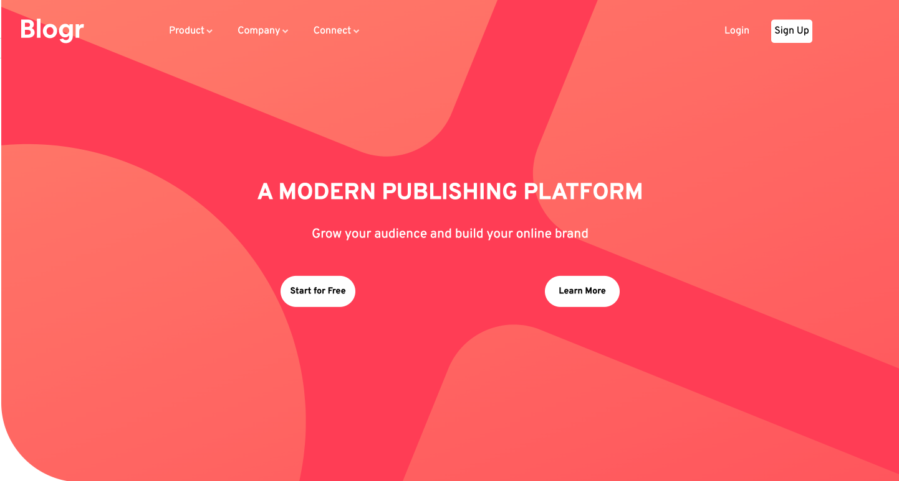
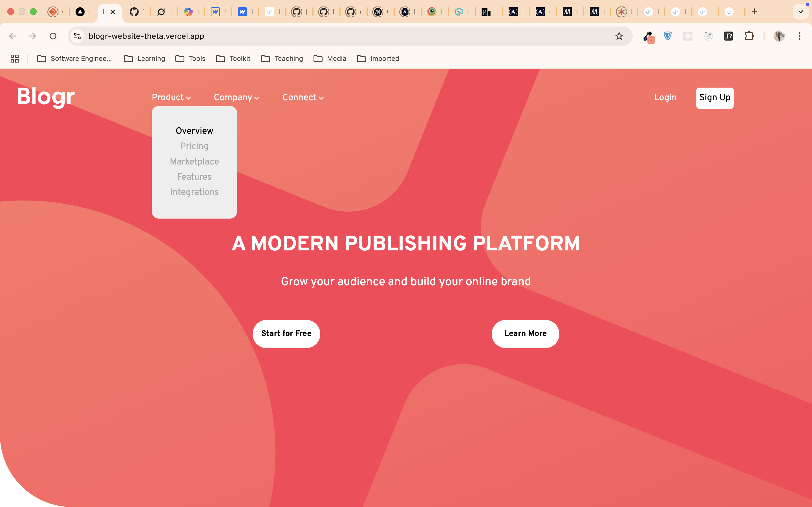
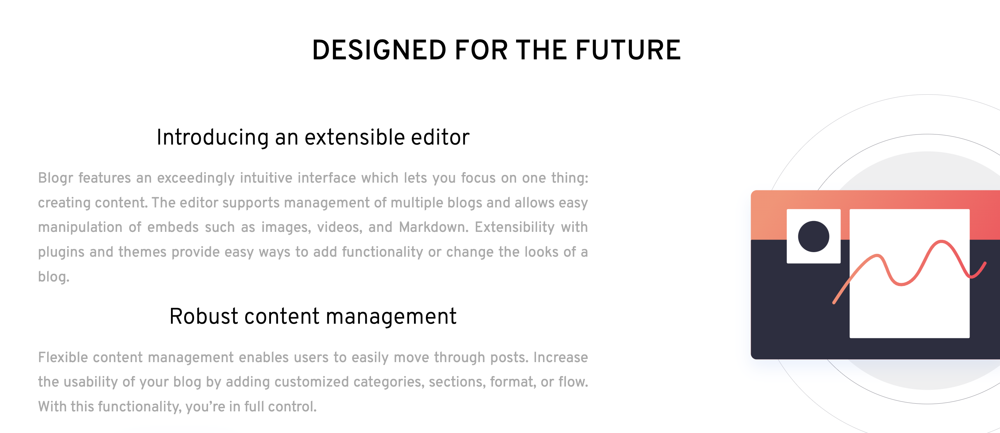
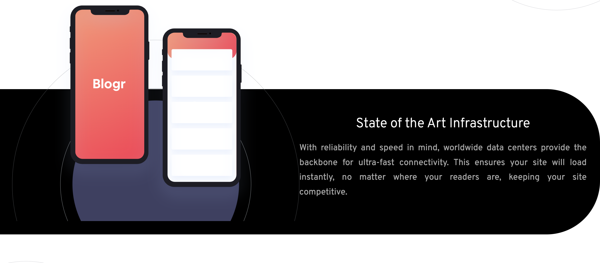

# Frontend Practise (*HTML5, CSS3, JS*)

## Layout with Flex and Playing with Position Properties
## Using CSS for content hidding and content displaying is so much fun!

This project is from frontend mentor challenges.
This is written in mobile first approach with two breakpoints: 768px and 1024px.
Here are some challenges I overcome along the journey:

*1. Writing CSS for Mobile Menubar to Desktop Navbar*

*2. Adjusting Images and Background Images for different views*


### The fun parts are:

1. **JS**
```
let nav = document.querySelector("nav");
let lists = document.querySelectorAll(".nav-list-item");
let menu = document.querySelector(".menu");
let state = false;

menu.addEventListener("click", ()=>{
    nav.classList.toggle("transform");
    state = !state;
    state ? menu.src = './images/menu-close.svg' : menu.src = './images/icon-hamburger.svg';
})

lists.forEach((list)=>{
    list.addEventListener("click",(e)=>{
        let subMenuName = e.target.innerText.toLowerCase();
        let subList = document.querySelector("."+subMenuName);
        subList.classList.toggle("open");
    })
})
```

2. **CSS**
```
header{
      background-size: 450%;
      background-position: -700px -1350px;
      border-bottom-left-radius: 8rem;
}
```
```
nav{
    height: 50vh;
    overflow-y: scroll;
    scrollbar-color: #FF3D54 #CCC;
    background-color: white;
    padding: 2rem;
    border-radius: .8rem;
    position: absolute;
    color: #000;
    width: 85%;
    top: 110px;
    left: 25px;
    text-align: center;
    transform: translateX(-120%);
    opacity: 0;
    transition: all .8s ease;
    z-index: 1;
    user-select: none; /*Disable User Selection for Nav Item*/
}
nav  ul, nav > ul > li{
    margin-bottom: 1.2rem;
    cursor: pointer;
}
```
```
/*For Nav JS*/
.transform{
    transform: none;
    opacity: 1;
}
.open{
    display: block;
}
```
```
/*Mobile to Desktop Navbar*/
header > .logo > .menu{
        display: none;
}
nav{
    width: 80%;
    overflow: visible;
    height: auto;
    display: flex;
    transform: none;
    opacity: 1;
    background-color: unset;
    position: relative;
    top: -80px;
    left: 200px;
    color: #FFF;
}
nav > .nav-left > li > ul {
    position: absolute;
}
nav > ul > li > span::after{
    content: url('./images/icon-arrow-light.svg');
}
nav>ul{
    display: flex;
    margin: 0;
}
```

Here is the project demo: [Click here](https://blogr-website-theta.vercel.app/)

### Desktop View



### Mobile View


